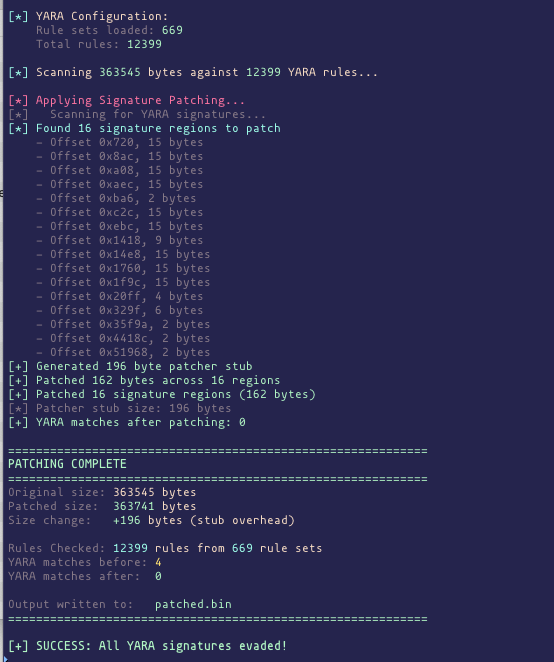

# Shellcode Signature Patcher

YARA signature evasion via targeted byte patching. Scans shellcode for YARA matches and XORs only the specific bytes that trigger detections.


## How It Works

1. Scans shellcode against 12,000+ YARA rules
2. Identifies exact bytes that trigger signature matches
3. XORs only those bytes with a random key
4. Prepends a tiny runtime stub (~130 bytes) that patches bytes back before execution
5. Shellcode executes normally after runtime patching

**Key advantage**: Minimal modification - only signature bytes are changed, preserving shellcode functionality.

## Installation

```bash
cd shellcode-mutator
python3 -m venv venv
source venv/bin/activate
pip install -r requirements.txt
```

### Requirements

- Python 3.8+
- keystone-engine >= 0.9.2
- yara-python >= 4.3.0

### macOS Note

If keystone fails to load, you may need to build it from source:

```bash
git clone https://github.com/keystone-engine/keystone.git
cd keystone
mkdir build && cd build
cmake -DBUILD_SHARED_LIBS=ON -DCMAKE_OSX_ARCHITECTURES="arm64;x86_64" ..
make -j8
sudo cp llvm/lib/libkeystone.dylib /opt/homebrew/lib/
```

Then run with:
```bash
DYLD_LIBRARY_PATH=/opt/homebrew/lib python3 mutator.py ...
```

## Usage

### Basic Patching

```bash
# Patch shellcode
python3 mutator.py payload.bin -o patched.bin

# With verbose output
python3 mutator.py payload.bin -o patched.bin -v

# From stdin
cat payload.bin | python3 mutator.py - -o patched.bin
```

### Scan Only (No Patching)

```bash
# Human-readable report
python3 mutator.py payload.bin --scan-only

# JSON output
python3 mutator.py payload.bin --scan-only --json
```

### Options

```
positional arguments:
  input                 Input shellcode file (use - for stdin)

options:
  -o, --output          Output file for patched shellcode
  --arch {x64,x86}      Architecture (default: x64)
  --scan-only           Only scan for signatures, do not patch
  --json                Output results as JSON
  -v, --verbose         Verbose output
  --rules-dir           Additional YARA rules directory
  --list-rules          List all loaded YARA rules and exit
```

## Testing Patched Shellcode

```bash
# Generate C header from patched shellcode
xxd -i patched.bin | sed 's/patched_bin/shellcode/g' > shellcode.h

# Compile test loader (requires mingw)
x86_64-w64-mingw32-gcc simple_loader.c -o loader.exe
```

## Example Output



## Project Structure

```
shellcode-mutator/
├── mutator.py              # Main tool
├── simple_loader.c         # Test loader for Windows
├── requirements.txt        # Python dependencies
├── engine/
│   ├── __init__.py
│   ├── signature_patcher.py  # Core patching logic
│   ├── yara_scanner.py       # YARA scanning
│   └── pattern_detector.py   # Pattern detection
└── rules/                  # YARA rules (12,000+)
```

## Adding Custom YARA Rules

Place `.yar` or `.yara` files in the `rules/` directory or use `--rules-dir`:

```bash
python3 mutator.py payload.bin --rules-dir /path/to/custom/rules -o patched.bin
```

## How the Runtime Stub Works

The prepended stub:
1. Saves all registers and flags (pushfq, push rax/rbx/rcx/rdx/rsi/rdi/r8)
2. Loads patch table address via RIP-relative LEA
3. Iterates through patch entries, XORing bytes back to original
4. Restores registers and flags
5. Jumps to the original shellcode entry point

Patch table format (7 bytes per entry):
- Offset (4 bytes) - position in shellcode
- Length (2 bytes) - number of bytes to patch
- XOR key (1 byte) - key used for this region

## Limitations

- Currently only supports x64 shellcode
- Stub adds ~130-200 bytes overhead depending on patch count
- Some YARA rules may still match (e.g., stack string patterns)

## License

For authorized security testing only.

## Credits
Written by @nickvourd & @kypvas
